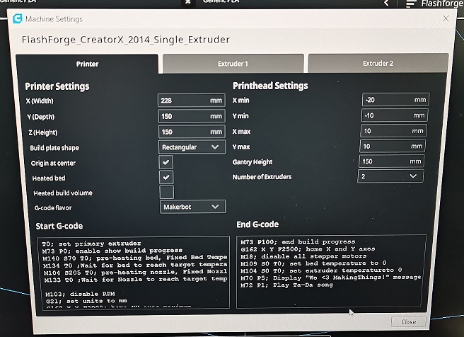

# FlashForge_Creator_X Cura 4.8.0 Settings
This repository is to keep the Gcode for Single and Dual Extruder Configurations.

The Flashforge Creator X (2014 model) was configured using Sailfish version 7.2.

The original manual is based off here https://3duniverse.org/3D%20Universe's%20Unofficial%20FlashForge%20Creator%20X%20Manual.pdf using Slic3r's example. The Gcode has been modified slightly to adapt to the current configurations for FlashForge Creator X (2014 model). 

The printer profile is based on the Makerbot Replicator which only has a single extruder. To be able to configure to dual extruders, you will need to configure or add the .json files 
1. ```makerbotreplicator.def.json``` (folder location eg. C:\Program Files\Ultimaker Cura 4.8.0\resources\definitions) 
2. ```makerbotreplicator_extruder_1.def.json``` (folder location eg. C:\Program Files\Ultimaker Cura 4.8.0\resources\extruders)

For Reference on Cura basic settings on the FlashForge Creator X 2014 Model, 


Please remember to adjust these few lines for temperature settings (I found that in Cura, the nozzle temp settings doesn't carry over to the Gcode properly most likely due to Sailfish way of interpretation is slightly different)

For single filament prints (located in ```GCode Start Code Creator X Single Material.txt``` file), please adjust the S*_temperature_* value according to your filament and bed settings
* ```M140 S70 T0; pre-heating bed, Fixed Bed Temperature *Important to adjust here if manual*```
* ```M134 T0 ;Wait for bed to reach target temperature```
* ```M104 S205 T0; pre-heating nozzle right, Fixed Nozzle Temperature *Important to adjust here if manual*```
* ```M133 T0 ;Wait for Nozzle to reach target temperature```

For dual filament prints (located in ```GCode Start Code Creator X Dual Material.txt``` file), please adjust the S*_temperature_* value according to your filament and bed settings
* ``` M140 S70 T0; pre-heating bed, Fixed Bed Temperature *Important to adjust here if manual*``` 
* ``` M134 T0 ;Wait for bed to reach target temperature``` 
* ``` M104 S205 T0; pre-heating nozzle right, Fixed Nozzle Temperature *Important to adjust here if manual*``` 
* ``` M133 T0 ; Wait for Nozzle Right to reach target temperature``` 
* ``` M104 S205 T1; pre-heating nozzle left, Fixed Nozzle Temperature *Important to adjust here if manual*``` 
* ``` M133 T1 ; Wait for Nozzle Left to reach target temperature``` 
